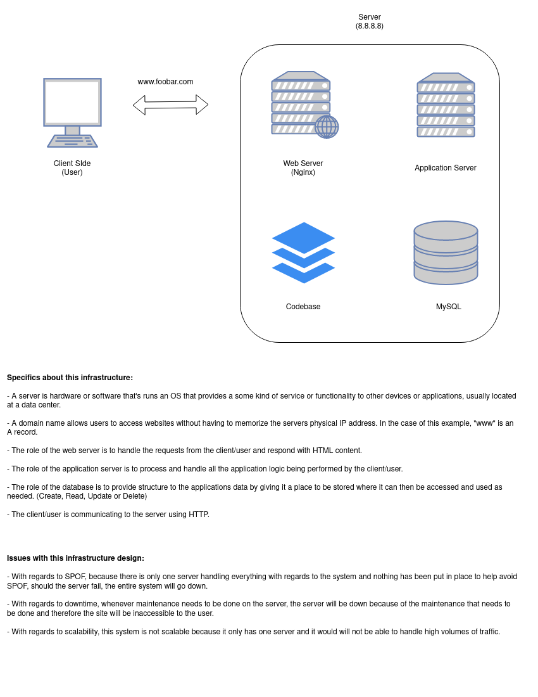
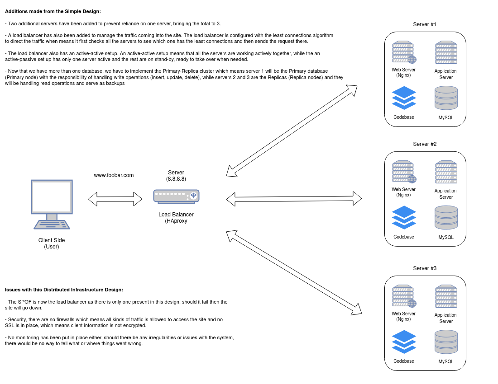
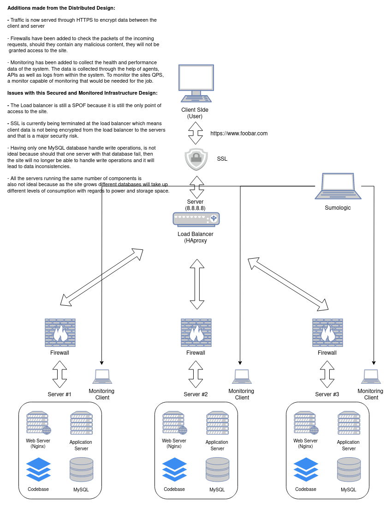

# 0x09. Web infrastructure design

This directory focuses on Web Infrastructure Design.

Each file contains a link to a whiteboard diagram of a specific web infrastructure design.

### Task 0: Simple web stack

- **File**: `0-simple_web_stack`

### Task 1: Distributed web infrastructure

- **File**: `1-distributed_web_infrastructure`

### Task 2: Secured and monitored web infrastructure

- **File**: `2-secured_and_monitored_web_infrastructure`

